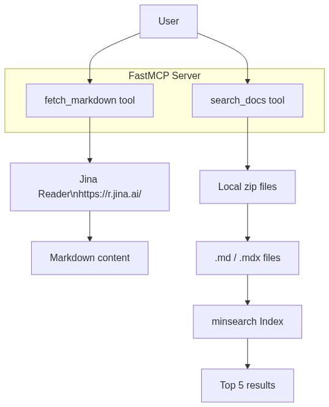

# Project documentation (beginner-friendly)

This file explains what we built in this folder and how to use it.

## What we built

1) An MCP server (`main.py`) with two tools:
   - `fetch_markdown(url, timeout_s=10)` fetches a web page as markdown
     using Jina Reader.
   - `search_docs(query, limit=5)` searches markdown/mdx files inside
     local zip archives using minsearch.

2) A search script (`search.py`) that:
   - downloads the FastMCP GitHub repo zip (if missing),
   - reads all local `*.zip` files,
   - extracts only `.md` and `.mdx` files,
   - removes the first path segment from filenames,
   - builds a text index with minsearch,
   - runs a small demo search.

3) A simple test (`test.py`) that calls the Jina Reader fetch function.

## Diagram



## Jina Reader tool (fetch_markdown)

Jina Reader turns a web page into markdown if you put `https://r.jina.ai/`
in front of the URL.

Example:
```
https://r.jina.ai/https://datatalks.club
```

In `main.py`, the `fetch_markdown` MCP tool calls the helper
`_fetch_markdown_impl` which:
1) adds `https://` if the URL has no scheme,
2) calls Jina Reader with `requests`,
3) returns the markdown text.

## Search tool (search_docs)

`search_docs` is an MCP tool that uses the code in `search.py`.
It always:
1) ensures `fastmcp-main.zip` exists (downloads if missing),
2) loads `.md` and `.mdx` files from all local zip files,
3) builds a minsearch `Index`,
4) returns the top results for your query.

Each result contains:
- `filename`: the path without the first folder
- `content`: the markdown text

## How the "data" count was computed

We fetched markdown from DataTalks.Club and counted the word "data"
case-insensitively.

Command used (PowerShell):
```
uv run python -c "from main import _fetch_markdown_impl; text=_fetch_markdown_impl('https://datatalks.club'); print(text.lower().count('data'))"
```

Result at the time:
- Count: 61

## How to run

Install dependencies:
```
uv sync
```

Run the MCP server:
```
uv run python main.py
```

Run the search demo:
```
uv run python search.py
```

Run the Jina Reader test:
```
uv run python test.py
```
